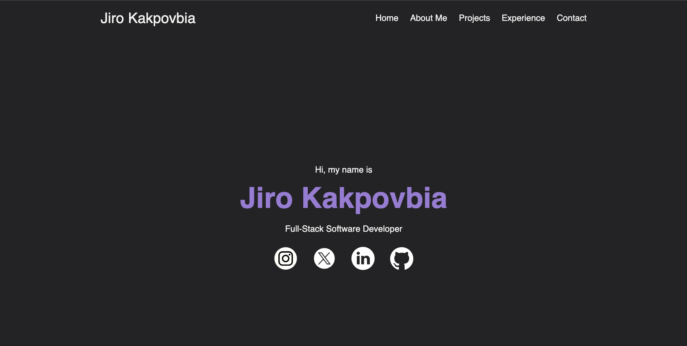

## Hi, My name is Jiro Kakpovbia! 👋

<!--
**JiroKakpovbia/JiroKakpovbia** is a ✨ _special_ ✨ repository because its `README.md` (this file) appears on your GitHub profile.

Here are some ideas to get you started:

- 🔭 I’m currently working on ...
- 🌱 I’m currently learning ...
- 👯 I’m looking to collaborate on ...
- 🤔 I’m looking for help with ...
- 💬 Ask me about ...
- 📫 How to reach me: ...
- 😄 Pronouns: he/him
- ⚡ Fun fact: ...
-->

I'm a 3rd-year Computer Science student at the University of Waterloo, graduating in Spring 2027 — welcome to my GitHub Profile! Here you'll find a list of the projects I've either worked on in the past or am currently updating.

Be sure to check out my [Personal Website](https://jirokakpovbia.ca) for more about me, my experiences, and anything else you're curious about!

